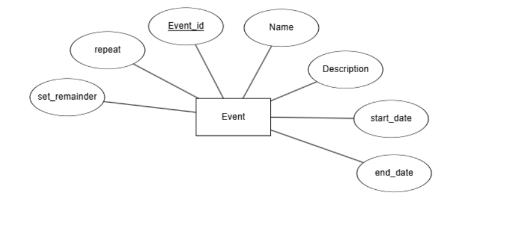
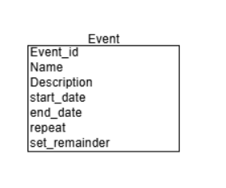
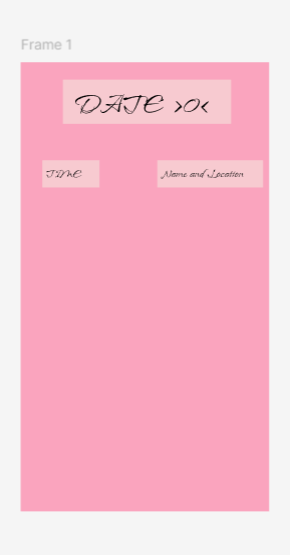
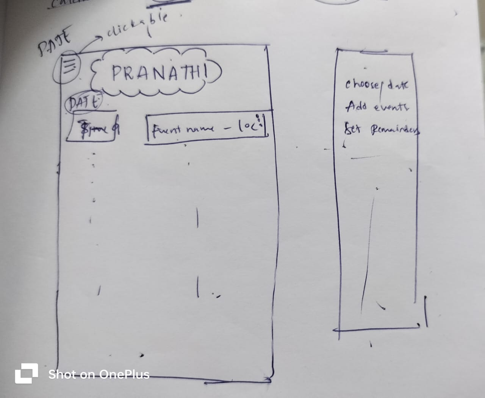

# Time-Table

The current idea is to create a simple time table which can keep track of my academics, personal project time, club works and internship hunting... 

# Databases

It has the simplest version of the calender right now, which is supposed to be able to add, edit and delete events as required by the user. 

So far it only has one entity, but if I continue to proceed with this, I might add more entities and attributes.

# Design

I have kept a simplistic design for the Mobile app, which lets the user be able to use all the functionalities properly.

This gives a basic idea of how the website is intended to look. 